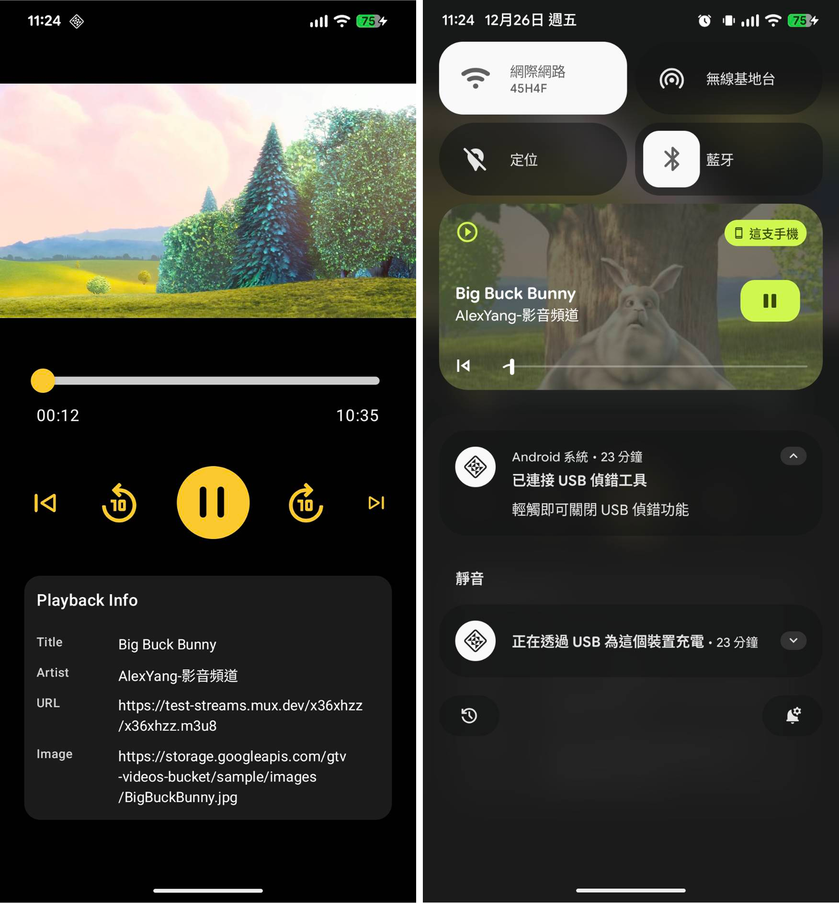

# Alex ExoPlayer HLS Compose（Session Commands）

## 專案簡介

本專案是一個 **Android 原生影音播放器工程級示範**，完整整合：

* **Media3 (ExoPlayer)** 播放 HLS 串流
* **MediaSessionService** 支援系統媒體控制
* **系統媒體通知（Notification）**
* **Jetpack Compose UI**
* **單一 ExoPlayer / MediaController 架構設計**

目標是展示一套：

> UI / ViewModel / MediaController / MediaSession / PlaybackService **狀態一致、可維運、可除錯** 的播放器架構。

---

## Demo

| Screenshot                            |
|---------------------------------------|
|  |

---

## 專案特色

* ✅ 單一 ExoPlayer Instance（避免重播 / 時間歸零問題）
* ✅ MediaController 統一控制播放狀態
* ✅ Notification / 系統媒體控制與 App UI 完全同步
* ✅ App 支援背景播放
* ✅ 支援從 Notification 點擊回到 App
* ✅ Compose UI 與 Player 狀態解耦（StateFlow）

---

## 主要依賴
```kotlin
// --- ExoPlayer ---
implementation("androidx.media3:media3-ui-compose:1.9.0")
implementation("androidx.media3:media3-exoplayer:1.9.0")
implementation("androidx.media3:media3-ui:1.9.0")
implementation("androidx.media3:media3-exoplayer-hls:1.9.0")
implementation("androidx.media3:media3-session:1.9.0")

// Coil
implementation(libs.coil)
implementation(libs.coil.compose)

implementation("org.jetbrains.kotlinx:kotlinx-coroutines-guava:1.8.1")
```

---

## 專案架構

```
com.alex.yang.hlsexoplayerv2compose
│
├── App.kt
├── MainActivity.kt
│
├── ui.theme
│   └── （Theme / Color / Typography）
│
└── feature.player
    │
    ├── data
    │   └── model
    │       └── FakeMediaData.kt
    │
    ├── notification
    │   └── AppNotificationChannel.kt
    │
    ├── playback
    │   ├── MediaControllerManager.kt
    │   ├── MediaDescriptionAdapter.kt
    │   ├── MediaSessionCallback.kt
    │   ├── PlaybackCommands.kt
    │   └── PlayerNotificationListener.kt
    │
    ├── service
    │   └── PlaybackService.kt
    │
    ├── presentation
    │   ├── component
    │   │   ├── InfoRow.kt
    │   │   ├── MediaInfo.kt
    │   │   ├── PlayerActions.kt
    │   │   └── PlayerSlider.kt
    │   │
    │   ├── PlayerScreen.kt
    │   ├── PlayerUiAction.kt
    │   ├── PlayerUiState.kt
    │   └── PlayerViewModel.kt
    │
    └── di
        └── PlayerModule.kt

```

核心原則：

* **UI 不直接持有 ExoPlayer**
* **所有播放行為只經由 MediaController**
* **PlaybackService 是唯一持有 ExoPlayer 的地方**

---

## 專案模組與檔案說明

### UI / Compose

* `PlayerScreen.kt`

    * 播放畫面
    * 播放 / 暫停 / Seek UI

* `PlayerViewModel.kt`

    * 播放狀態管理（StateFlow）
    * 發送播放指令（Play / Pause / Seek）

* `PlayerUiState.kt`

    * UI 狀態模型（isPlaying / currentTime / duration）

* `PlayerUiAction.kt`

    * UI → ViewModel 事件定義


---

### Media3 / MediaSession

* `PlaybackService.kt`

    * `MediaSessionService`
    * 建立 `MediaSession`
    * 持有 **唯一 ExoPlayer**

* `MediaSessionCallback.kt`

    * 處理系統媒體控制（Play / Pause / Seek）

* `PlaybackCommands.kt`

    * 自訂 Session Command（如 ±10 秒）

* `MediaControllerManager.kt`

    * App 內 MediaController 單例管理

---

### Notification

* `AppNotificationChannel.kt`

    * 建立媒體通知 Channel

* `PlayerNotificationListener.kt`

    * Notification 前景 / 移除行為控制

* `MediaDescriptionAdapter.kt`

    * Notification 顯示內容（Title / Subtitle）
    * PendingIntent 回到 App

---

### Fake / Demo

* `FakeMediaData.kt`

    * 測試用 HLS 串流資料

---

## 播放流程說明

### 1️⃣ App 內播放

1. UI 觸發 `PlayerUiAction.Play`
2. ViewModel 呼叫 `MediaController.play()`
3. MediaController 轉交 MediaSession
4. PlaybackService 控制 ExoPlayer 播放

---

### 2️⃣ 系統媒體通知控制

1. 使用者操作 Notification（Play / Pause）
2. MediaSessionCallback 收到指令
3. ExoPlayer 狀態更新
4. MediaController 同步狀態回 UI

---

### 3️⃣ App 滑掉 / 背景播放

* PlaybackService 進入 Foreground
* Notification 持續顯示
* ExoPlayer 持續播放

---

### 4️⃣ 從 Notification 回到 App

* Notification PendingIntent 開啟 `MainActivity`
* MediaController 重新連線 MediaSession
* UI 從 MediaController 同步狀態

---

## 常見問題與設計重點

### 為什麼 UI 不直接用 ExoPlayer？

* 避免 Activity / Compose 重建造成播放器重置
* 避免時間歸零、重播問題
* 符合 Media3 官方建議架構

---

### 為什麼一定要 MediaSession？

* 系統媒體通知
* 藍牙耳機控制
* 鎖屏控制
* 車用系統（Android Auto）

---

## 適合延伸實作

* 🔹 DRM（Widevine）
* 🔹 HLS / DASH 離線下載
* 🔹 Transformer 轉檔輸出
* 🔹 多播放清單
* 🔹 背景播放服務最佳化

---
## Author

**Alex Yang**  
Android Engineer  
🌐 [github.com/m9939418](https://github.com/m9939418)


## ⭐ 如果這個專案對你有幫助，請給個 Star！

**Happy Coding! 🚀**